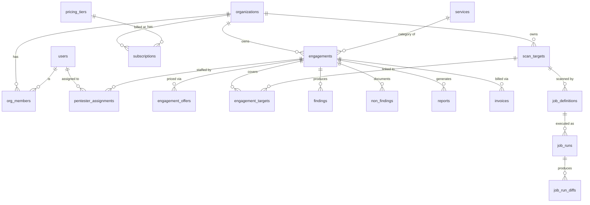
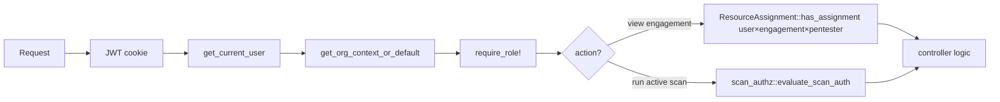
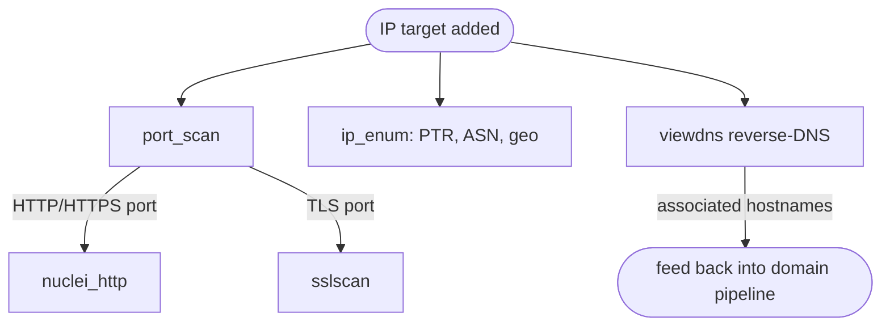
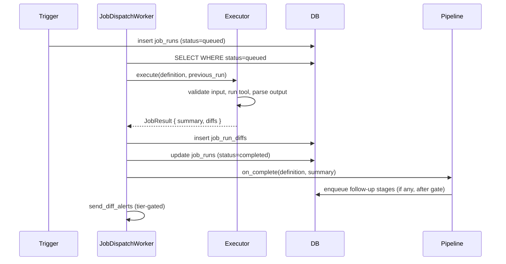
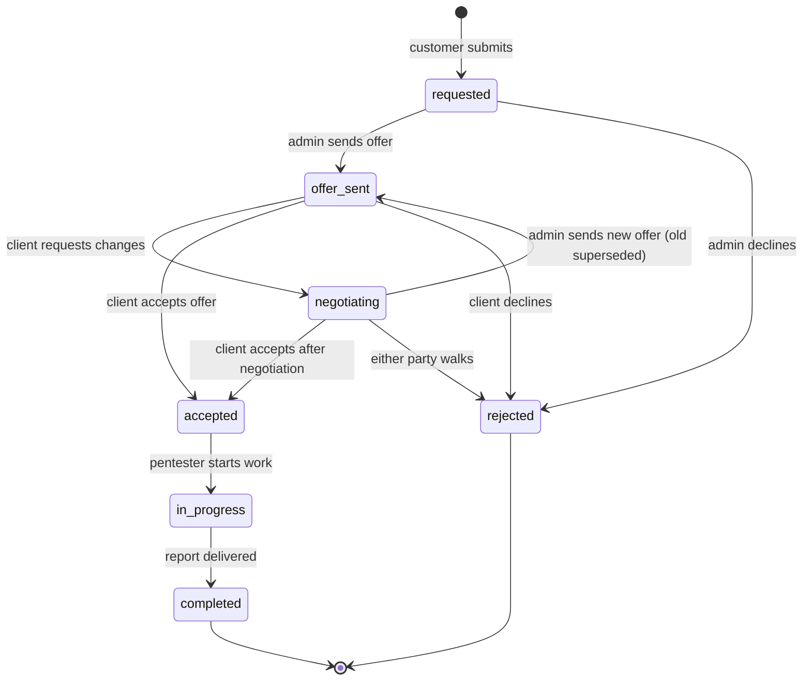

# Architecture — fracture-pt (gethacked.eu)

## Purpose

fracture-pt is an EU-focused security/pentesting portal. Customers add scan targets (domains, IPs, IP ranges), the platform performs continuous attack-surface management and runs pentesting tools against them under a tiered authorization model, and findings are turned into PDF reports via [pentext-docbuilder](https://github.com/radicallyopensecurity/pentext-docker).

Severity scale is **Extreme / High / Elevated / Moderate / Low** (no CVSS). The portal does not make compliance or certification claims.

## Stack

| Layer | Choice |
|---|---|
| Language | Rust 1.94+ |
| Web framework | Loco 0.16 (Axum 0.8) |
| ORM | SeaORM 1.1 (SQLite dev, Postgres prod) |
| Templating | Tera (autoescape on) |
| i18n | Fluent (via fluent-templates) |
| Auth | OIDC (Zitadel by default) — provided by `fracture-core` |
| Markdown | comrak (`unsafe = false`) |
| Background jobs | Loco's worker + Tokio |
| Container runtime | Podman compose for dev, ghcr.io images for prod |
| Report PDF | pentext-docbuilder (subprocess, not yet a sidecar) |

## Library / app split

fracture-pt depends on **`fracture-core`** (the library half of `fracture-cms`) for: OIDC, sessions, organisations, RBAC, generic ownership (`OrgScoped` trait, `ResourceAssignment` model), file uploads, generic jobs framework, mailers, security headers, blog. The dependency direction is one-way: PT → CMS. Forks of CMS code in PT are forbidden — upstream the change instead.

```
┌─────────────────────────────────────────────────┐
│  fracture-pt                                    │
│  ────────────                                   │
│  • engagements, findings, reports, invoices     │
│  • scan_targets, pentester_assignments          │
│  • scan jobs (asm_scan, port_scan, …)           │
│  • services (asm, port_scan, scan_authz, tier)  │
│  • templates, views, controllers                │
└──────────────────┬──────────────────────────────┘
                   │ depends on
                   ▼
┌─────────────────────────────────────────────────┐
│  fracture-core                                  │
│  ──────────────                                 │
│  • users, organizations, org_members            │
│  • OIDC, sessions, security headers, CSP        │
│  • OrgScoped trait, ResourceAssignment model    │
│  • generic JobExecutor / JobRegistry            │
│  • uploads, blog, mailers                       │
└─────────────────────────────────────────────────┘
```

## Domain model



### Key entities

| Entity | Owned by | Purpose |
|---|---|---|
| `organizations` | (root) | Tenant boundary. Single-org-per-user is the default; teams optional. |
| `org_members` | org | User ↔ org link with role (`Viewer`/`Member`/`Admin`/`Owner`). |
| `scan_targets` | org | Domain, IP, or IP range to monitor/test. Has `verified_at` for ownership proof. |
| `engagements` | org | Scope-of-work for a manual or hybrid pentest. Status state machine. |
| `engagement_offers` | engagement | Priced offer + terms; `accepted` status moves engagement forward. |
| `engagement_targets` | engagement | Many-to-many link from engagements to scan_targets — drives the active-scan gate. |
| `pentester_assignments` | engagement | User × engagement with role. *Will move to `ResourceAssignment` from CMS in a follow-up PR.* |
| `findings` / `non_findings` | engagement | Output of pentest work; severity is Extreme/High/Elevated/Moderate/Low. |
| `reports` | engagement | PDF deliverables (built via pentext-docbuilder). |
| `invoices` | engagement | Billing artifacts. |
| `services` | platform | Catalog of pentest service types (e.g. "External pentest", "Web app pentest"). |
| `pricing_tiers` / `subscriptions` | platform / org | Self-service subscription tiers. |
| `job_definitions` / `job_runs` / `job_run_diffs` | org (via core) | Scan pipeline state. |

## Authentication & authorization

OIDC is delegated to fracture-core (PKCE, nonce, JWKS verification, audience claim, JWT cookies with HttpOnly + SameSite=Lax + 15-min TTL + server-side `session_invalidated_at`). PT inherits the model.

**Org roles** (CMS-defined): `Viewer < Member < Admin < Owner`. Stable; do not extend.

**Per-resource roles** (CMS infrastructure, PT-defined values): the `"pentester"` role lives in PT and is granted via the generic `ResourceAssignment` model in CMS. The pentester role:
- Sees the engagement they are assigned to (regardless of org membership).
- Edits findings on that engagement.
- Comments on that engagement.
- Cannot manage org membership, settings, or other engagements.



## Scan pipeline — target architecture

The pipeline is a directed graph of stages. Each stage is a `JobRun` of a particular `job_type`. When a stage completes, the orchestrator inspects its result and enqueues the *next* stages, gated by [`scan_authz`](SCAN_AUTHZ.md).

### Stages

| Stage | Mode | Tool | Sidecar image |
|---|---|---|---|
| `asm_scan_passive` | passive | crt.sh + amass passive sources | (current: in-app; planned: amass sidecar) |
| `asm_scan_active` | active | amass active brute-force | amass sidecar |
| `port_scan` | active | nmap -sT -sV (top 100 ports, unprivileged) | nmap sidecar |
| `nuclei_http` | active | nuclei (HTTP/HTTPS templates) | nuclei sidecar |
| `sslscan` | active | sslscan | sslscan sidecar |
| `ip_enum` | passive | PTR / RDAP / ASN / geo | (built-in) |
| `viewdns_lookup` | passive | viewdns-style passive intel (reverse DNS, MX, NS history) | (built-in HTTP fetch) |
| `report_build` | n/a | pentext-docbuilder | (current: subprocess; future: sidecar) |

### Domain target pipeline

```mermaid
sequenceDiagram
    actor User
    participant UI
    participant Controller
    participant Orchestrator
    participant Worker
    participant ScanAuthz

    User->>UI: Add domain example.com
    UI->>Controller: POST /scan-targets
    Controller->>Worker: enqueue asm_scan_passive(example.com)

    Worker->>ScanAuthz: evaluate(target, caller)
    ScanAuthz-->>Worker: passive=yes
    Worker->>Worker: crt.sh + amass passive
    Worker-->>Orchestrator: {subdomains: [...], ips: [...]}

    par Per resolved IP
        Orchestrator->>Worker: enqueue port_scan(ip) [active — gate]
        Orchestrator->>Worker: enqueue ip_enum(ip) [passive]
        Orchestrator->>Worker: enqueue viewdns_lookup(host) [passive]
    end

    Worker->>Worker: nmap port_scan(ip)
    Worker-->>Orchestrator: {open_ports: [{80,http},{443,https},{22,ssh}]}

    par Per HTTP port
        Orchestrator->>Worker: enqueue nuclei_http(ip:80) [active — gate]
    and Per TLS port
        Orchestrator->>Worker: enqueue sslscan(ip:443) [active — gate]
    end

    Worker-->>UI: live tail; structured findings; diffs
```

### IP target pipeline

Mirror of the above without the subdomain enumeration step:



### IP range target pipeline

Enumerate IPs first (capped to a tier-dependent maximum), then run the per-IP pipeline against each.

### Tier gating in the pipeline

For each candidate next-stage, the orchestrator runs:

1. Lookup the `scan_target` (the orchestrator job knows its target via the parent stage's config).
2. Build a `ScanCaller` for the org's last-active member running the parent stage.
3. Call `scan_authz::evaluate_scan_auth(db, target, caller)`.
4. If the stage is `Active` and `auth.active_allowed` is `false`, mark the stage as `skipped: not authorized` with the denial reason, and continue with the rest of the graph.

This means a partially-verified pipeline still produces useful passive output without ever firing an unauthorized active scan.

## Job system

Built on fracture-core's `JobExecutor` trait + `JobRegistry`. Each job stores a structured `result_summary` (parsed JSON) and optionally a raw `result_output` (truncated to 100 KB; larger outputs are written to disk as uploads). Diffs against the previous successful run are computed and stored in `job_run_diffs`. Email alerts on diff are tier-gated.



## Engagement lifecycle



`accepted` and `in_progress` (with the test window covering now) are the only states that unlock active scans against linked targets.

## Plan tier system

`PlanTier::from_org()` reads `plan_tier` from org settings: `Free`, `Recon`, `Strike`, `Offensive`, `Enterprise`. Controls:

- `max_targets()` — number of scan targets allowed
- `scheduling_enabled()` — recurring schedules
- `email_alerts_enabled()` — diff notifications

This is **billing tier**, separate from the **scan-mode tier** (passive/active) described in `SCAN_AUTHZ.md`. They compose: a `Free` user can run passive scans on one target; bumping to `Recon` does not on its own unlock active scans against unverified targets.

## Use cases

### UC-1: Self-service domain monitoring

1. Visitor signs up via OIDC. A personal organisation is created.
2. They add a domain as a scan target.
3. The portal runs passive ASM (crt.sh + DNS resolution) immediately. Active scans are denied until verification.
4. The user verifies the domain via DNS TXT (placing the verification token).
5. Verified — the portal now runs nmap + nuclei + sslscan on a recurring schedule (tier-dependent).
6. On diff (new subdomain, new open port, new finding), the user is emailed.

### UC-2: Engagement-driven pentest

1. Customer requests an engagement, listing target systems.
2. Admin scopes the engagement and creates `engagement_targets`. The targets become eligible for active scans even without DNS TXT verification once the offer is `accepted` and the test window opens.
3. Admin sends a priced offer.
4. Customer accepts.
5. Admin assigns a pentester via `ResourceAssignment(user, "engagement", id, "pentester")`.
6. Pentester sees the engagement in their dashboard. They can run active tools against the linked targets, edit findings, and comment.
7. Pentester finalises findings; report PDF is built via pentext-docbuilder.
8. Invoice is generated.

### UC-3: Quick free scan (anonymous)

1. Visitor enters a domain on the public free-scan page.
2. Captcha + rate limit pass.
3. Portal runs *only passive* tools against the domain (no nmap, no nuclei, no sslscan).
4. Result page shows the surface map and any low-hanging cert/email-config findings.
5. CTA to sign up to monitor continuously.

## Deployment

Production is deployed via `fracture-ctl` (the IdP-agnostic CLI in the CMS repo) using `ghcr.io` images. The compose stack runs:

- `app` — fracture-pt
- `zitadel` — OIDC
- `mailcrab` (dev) / SMTP relay (prod) — email
- `pentext-docbuilder` — report rendering
- *(planned)* `worker` + per-tool sidecars for amass, nmap, nuclei, sslscan

Storage:
- SQLite or Postgres for app state
- Local volume for uploads (`/app/data/uploads`)
- Persistent volume for the SQLite file in dev (`gethacked_app_data`)

Secrets: env vars only (`JWT_SECRET`, `OIDC_CLIENT_*`, etc.). `.env` gitignored. See [DEPLOYMENT.md](https://github.com/Sp0Q1/fracture-cms/blob/main/docs/DEPLOYMENT.md) in the CMS repo for the full procedure.

## Future architecture

The current state and the target state diverge in three places. Each is captured as an open task and PR.

### 1. Per-tool sidecar containers

**Today**: nmap runs in the app process; pentext-docbuilder runs as a separate container; everything else is unimplemented.

**Target**: each external tool (amass, nmap, nuclei, sslscan) runs in its own container with read-only FS, capped CPU/memory/wall-clock, no shared volumes other than a per-job tempdir. The app communicates with sidecars via a shared `services::tool_runner` abstraction that builds argv, mounts tempdirs, and streams output.

**Why**: tool processes touching external networks should not share a process with the web request handler; resource limits should be enforced by the runtime, not by ad-hoc timeouts.

### 2. Pipeline orchestrator (stage graph)

**Today**: `AsmScanExecutor::execute()` directly calls `enqueue_ip_port_scan()` for resolved IPs.

**Target**: a `services::pipeline` module that declares the stage graph (subdomain enum → port scan → nuclei web + sslscan TLS; plus IP enum + viewdns in parallel). When a job completes, the dispatcher calls `pipeline::on_complete(db, definition, summary)` which decides what to enqueue next. Per-stage tier gating via [`scan_authz`](SCAN_AUTHZ.md).

**Why**: chaining shouldn't live inside individual executors; it should be declarative, so adding a new tool only requires adding it to the graph.

### 3. Pentester role via core `ResourceAssignment`

**Today**: PT-specific `pentester_assignments` table.

**Target**: PT migrates to `fracture_core::models::resource_assignments` (already merged in CMS as PR #69). PT defines the `"pentester"` role identifier in `src/auth/roles.rs`. No PT-specific assignment table.

**Why**: one mechanism for per-resource access prevents IDORs by construction and lets PT add new role kinds (e.g. `"reviewer"`) with a one-line constant rather than a new table.

## Cross-cutting concerns

### Security

See [`docs/SCAN_AUTHZ.md`](SCAN_AUTHZ.md) for the active-scan gate. Other security properties are codified in [`CLAUDE.md`](../CLAUDE.md) and re-summarised here:

- **Strict CSP** with no `unsafe-inline` / `unsafe-eval`. Server-rendered SVG for visualisation.
- **SRI** on all `/static/` assets.
- **HSTS**, X-Frame-Options=DENY, etc. — see `src/initializers/security_headers.rs`.
- **No raw SQL** — SeaORM only.
- **Argv-only** subprocess invocation; per-tool sidecars (target state).
- **Targets validated** by `services::port_scan::validate_target` (shared validator) before any tool sees them — reserved-suffix denylist, char allow-list, parsed IP path.

### Observability

`tracing` for structured logs. No metrics endpoint yet (Prometheus/OTEL planned). Healthcheck planned.

### Performance

- SeaORM with WAL-mode SQLite in dev; Postgres in prod.
- SQLite pragmas tuned in `src/initializers/sqlite_pragmas.rs`.
- Background jobs run on Tokio multi-thread runtime; per-job hard timeout.
- Result raw output truncated at 100 KB; larger payloads as uploads.

### i18n

Fluent FTL files under `assets/i18n/` (where present). Severity scale strings are user-facing — do not hardcode in templates without i18n keys.

## See also

- [`CLAUDE.md`](../CLAUDE.md) — invariants future contributors must preserve
- [`SCAN_AUTHZ.md`](SCAN_AUTHZ.md) — passive vs active gate
- [`README.md`](../README.md) — quick start
- fracture-cms [`docs/ARCHITECTURE.md`](https://github.com/Sp0Q1/fracture-cms/blob/main/docs/ARCHITECTURE.md) — the underlying CMS framework
