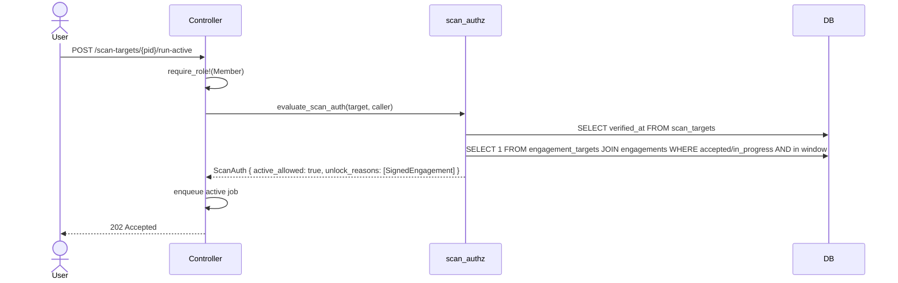

# Scan Authorization Gate

This document describes the tiered authorization gate that decides what kinds of scans are allowed against a `scan_target`. It is a security-critical contract: every per-tool integration in the scan pipeline depends on it.

Implementation: [`src/services/scan_authz.rs`](../src/services/scan_authz.rs).

## Why a tiered gate

Pentest tools fall into two safety tiers:

- **Passive** — does not contact the target, or contacts it only with traffic that looks like a normal browser/DNS query: crt.sh certificate transparency, passive DNS, RDAP / WHOIS, viewdns-style intel, amass passive sources, IP geolocation, BGP / ASN lookups.
- **Active** — sends traffic that can trigger an IDS or generate abuse complaints: nmap port scanning, nuclei web vulnerability scanning, sslscan TLS probing, amass active brute-force resolution.

The legal & operational difference is that active scans against systems you do not own or have not been authorized to test can be a criminal offense and will cause abuse complaints. The platform must not let a member trigger active scans against arbitrary domains. Passive scans use only public data and do not need this gate.

## What the gate decides

For each `scan_target`, the gate produces a `ScanAuth` value object answering:

- `passive_allowed: bool` — may the caller run passive scans?
- `active_allowed: bool` — may the caller run active scans?
- `active_denial: Option<DenialReason>` — when active is denied, why (UI shows verbatim).
- `unlock_reasons: Vec<UnlockReason>` — when active is allowed, which proofs unlocked it (so the UI can show "active scans enabled because: signed engagement covering target until 2026-05-12").

## The rules

| Caller state | Target state | Engagement state | Passive | Active | Reasoning |
|---|---|---|---|---|---|
| no role | any | any | no | no | controller's `require_role!` failed |
| Member+ | unverified | none | yes | no | safe public lookups only |
| Member+ | verified | any | yes | yes | proven scope ownership |
| Member+ | unverified | accepted/in_progress, in window | yes | yes | contracted scope |
| Member+ | unverified | requested/pending | yes | no | not yet signed |
| Member+ | unverified | accepted but window expired | yes | no | window matters |
| Member+ | unverified | accepted, future window | yes | no | window matters |
| Platform admin | any | any | yes | yes | logged override |

Multiple unlock reasons are tracked together (e.g., a verified target *and* a signed engagement both unlock active and both appear in `unlock_reasons`).

## What "verified" means

A `scan_target` is verified when `verified_at IS NOT NULL`. The mechanism is recorded in `verification_method` (today: `"dns_txt"`). The `verification_token` column holds the value the user must place in their TXT record, which a follow-up PR will check.

## What "signed engagement covering target" means

There exists at least one row in `engagement_targets` linking this `scan_target` to an engagement where:

- `engagements.status` is `"accepted"` or `"in_progress"`, AND
- the test window covers now: `test_window_start IS NULL OR test_window_start <= now`, AND
- `test_window_end IS NULL OR test_window_end > now`.

`offer_sent`, `requested`, `negotiating`, and `superseded` engagements do **not** unlock active scans.

## Sequence

## Caller responsibilities

1. **Resolve org membership and role first.** The gate trusts that the controller has already verified the caller is a Member+ of the target's owning org via `require_role!(org_ctx, OrgRole::Member)`. The gate's `has_member_role` field reflects that decision.
2. **Pass the right caller record.** Construct `ScanCaller { has_member_role, is_platform_admin }` from the resolved org context.
3. **Render the denial reason if denied.** `DenialReason::user_message()` returns text safe to show to end users.
4. **Log platform-admin overrides.** When `unlock_reasons` contains `PlatformAdminOverride`, an audit log entry must be written. (Pending follow-up PR.)

## Per-tool tier classification

| Tool | Mode |
|---|---|
| crt.sh subdomain enumeration | Passive |
| amass (passive sources only) | Passive |
| viewdns / RDAP / WHOIS / passive DNS | Passive |
| IP enumeration (PTR, ASN, geo) | Passive |
| amass (active brute force) | Active |
| nmap port scan | Active |
| nuclei web vulnerability scan | Active |
| sslscan TLS probing | Active |

## What this PR does and does not include

- ✅ The gate logic and `ScanAuth` value object
- ✅ Tests for every rule line in the matrix above
- ✅ This document
- ⏳ Wiring `evaluate_scan_auth` into existing controllers (port_scan currently has no gate; will be wired in PR-B / per-tool PRs)
- ⏳ The pipeline orchestrator that chains stages (next PR)
- ⏳ DNS TXT verification flow (next PR)
- ⏳ Audit log for platform-admin overrides (follow-up PR)
- ⏳ Per-tool sidecar containers (per-tool PRs)
