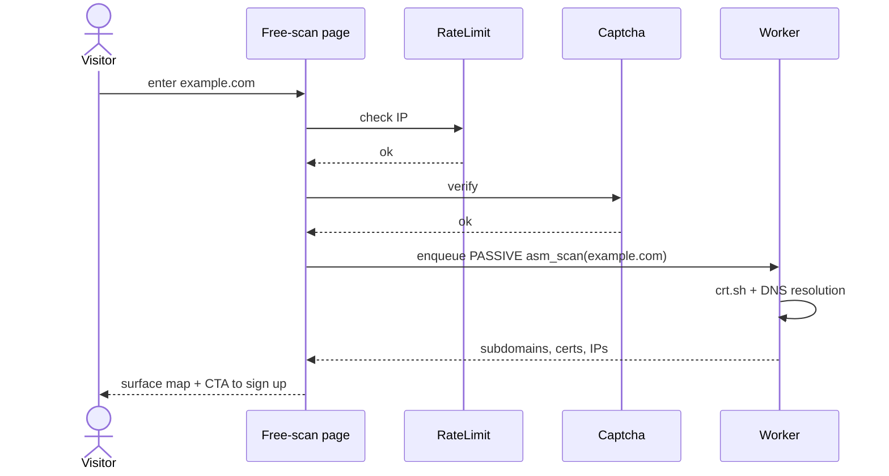
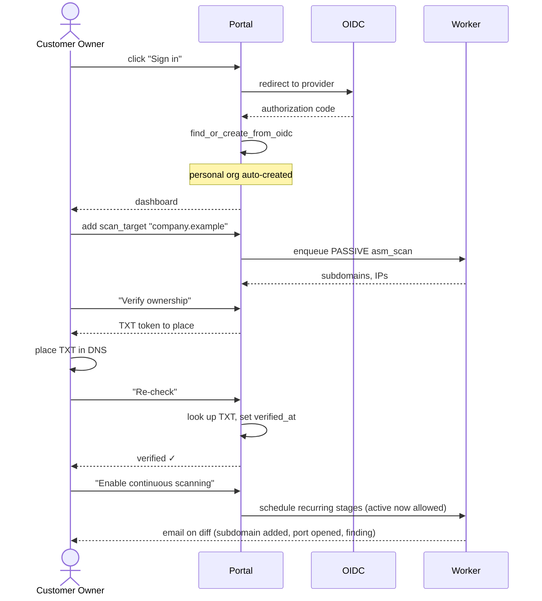
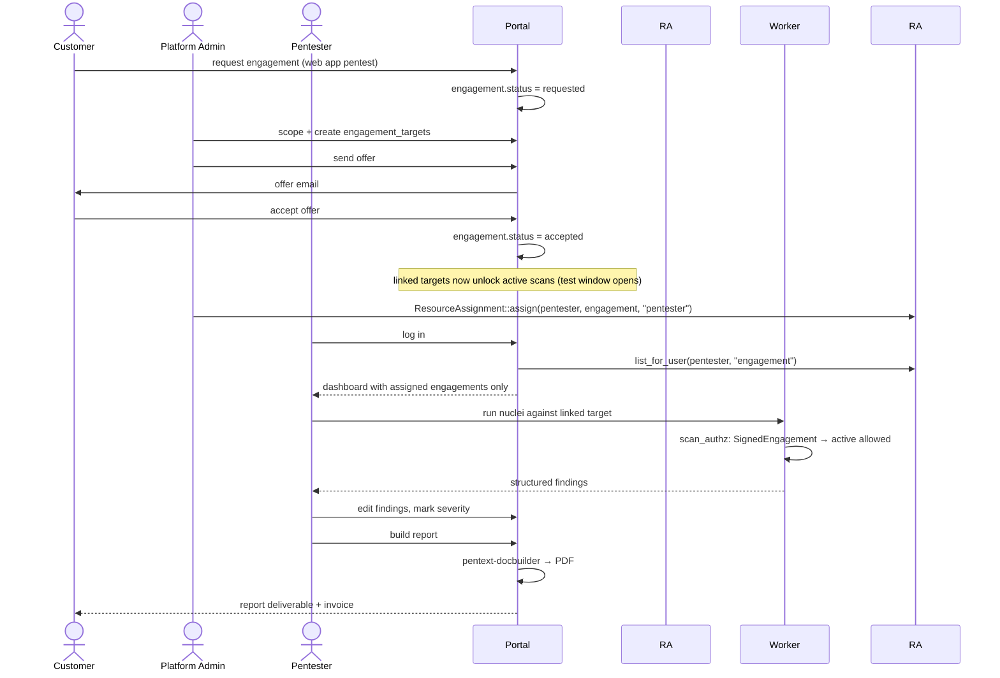
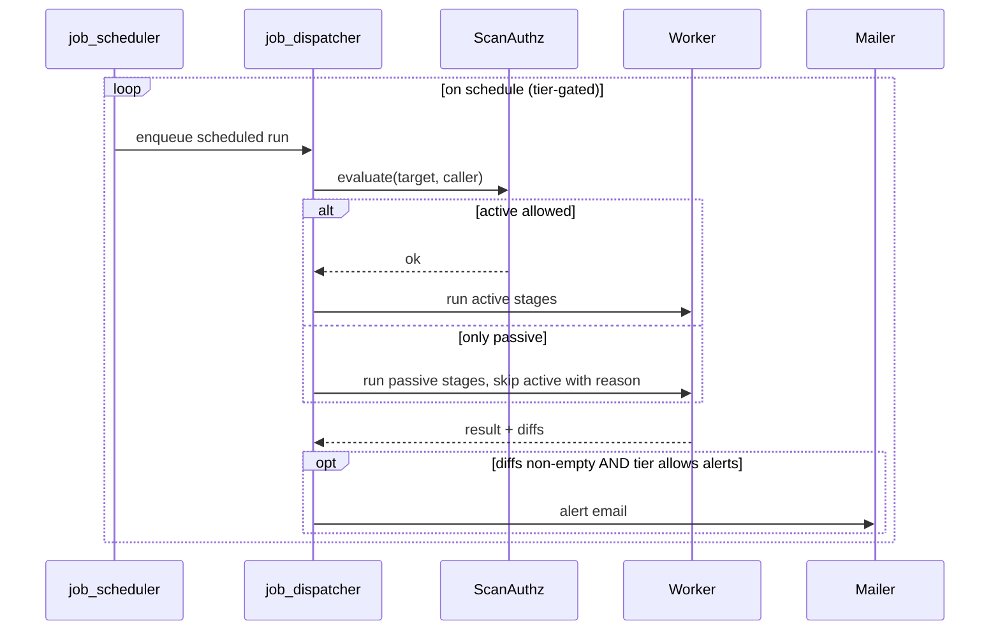
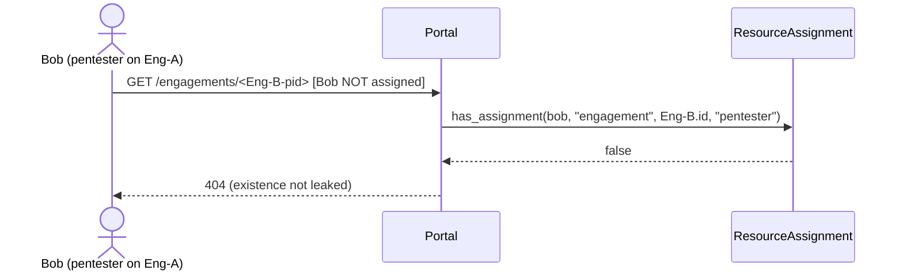
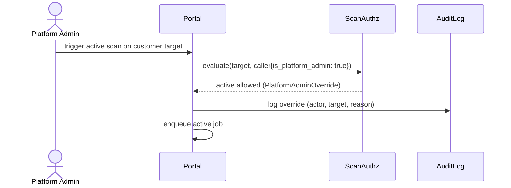
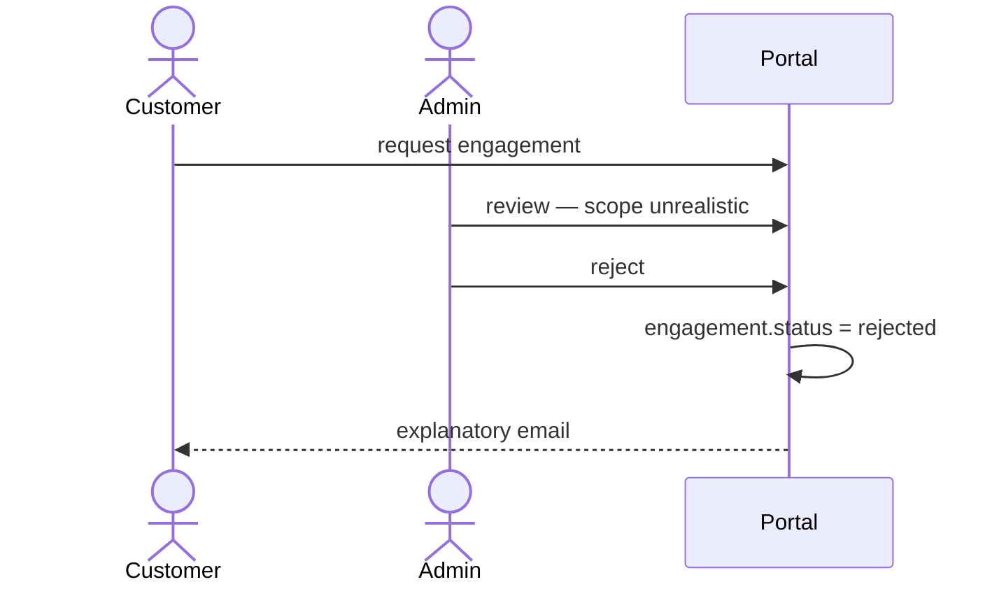

# Use Cases — fracture-pt

Named user journeys exercised by the portal. Use these for product-level reasoning, regression testing, and sequencing of features. Where they intersect security-critical contracts (scan authorization, IDOR prevention), the relevant constraint is called out.

## Personas

- **Customer Owner** — created an org, owns their data. Org role: `Owner`. Wants to monitor their company's attack surface and request pentests.
- **Customer Member** — invited into a customer org by the Owner. Org role: `Member` or `Viewer`. May view findings; may run scans depending on tier and target verification.
- **Pentester** — external contractor. *Not* an org member. Granted access to specific engagements via `ResourceAssignment`. Sees only their assigned engagements.
- **Platform Admin** — gethacked.eu staff. Has the platform-admin flag. Can view any org and override the active-scan gate (logged).
- **Anonymous Visitor** — no account. Can browse marketing pages and run a single rate-limited free scan.

## UC-1 — Anonymous free scan



**Constraints**: only passive tools run. No nmap, no nuclei, no sslscan. Rate-limited per IP. Captcha-gated.

## UC-2 — Self-service signup and continuous monitoring



**Constraints**:
- Free tier limits to 1 target.
- Active tools blocked until `verified_at` is set, OR a signed engagement covers the target.
- Email alerts only on tiers ≥ Recon.

## UC-3 — Engagement-driven manual pentest



**Constraints**:
- Pentester sees only assigned engagements (cross-engagement IDOR blocked at query layer via `ResourceAssignment`).
- Pentester cannot manage org membership.
- Active scans permitted *only* on linked targets in `accepted`/`in_progress` status with the test window open.

## UC-4 — Scheduled regression scan



**Constraints**:
- Scheduling enabled at tier ≥ Strike.
- Email alerts at tier ≥ Recon.

## UC-5 — Cross-engagement isolation (IDOR prevention)

This is a *negative* use case: it must not work.



**Constraints**: 404, not 403, to avoid leaking existence. The check is at the model/query layer, not just at the controller.

## UC-6 — Platform admin override

Used by gethacked.eu staff for incident response or customer support. Always logged.



**Constraints**: every override entry must be auditable (actor + target + timestamp). The audit log itself is a separate follow-up.

## UC-7 — Subscription change

```mermaid
sequenceDiagram
    actor Owner as Customer Owner
    participant Portal
    participant Tier as PlanTier

    Owner->>Portal: upgrade to Strike (€299/mo)
    Portal->>Portal: subscriptions row inserted
    Portal->>Portal: org settings.plan_tier = "strike"
    Portal->>Tier: from_org() → Strike
    note over Portal: scheduling_enabled = true; max_targets = 3
    Portal-->>Owner: features unlocked
```

## UC-8 — Manual scope-of-work decline



**Constraints**: targets that were linked to a rejected engagement do not unlock active scans (status check filters them out).

## Anti-use-cases (must fail)

These exist to be tested explicitly:

1. **Anonymous user runs nmap.** Free-scan flow is passive-only. Must fail.
2. **Customer Member runs nuclei against an unverified target with no engagement.** scan_authz denies. Must fail.
3. **Pentester sees an engagement they are not assigned to.** Returns 404 on direct PID access. Must fail.
4. **One org's user reads another org's findings via guessed PID.** `OrgScoped::find_in_org` filters at the model layer. Must fail.
5. **Active scan against `localhost`, `127.0.0.1`, `*.local`, `*.internal`, `*.onion`, `*.example`.** `validate_target` rejects. Must fail.
6. **Active scan against private RFC1918 IPs.** `validate_target` rejects. Must fail.
7. **Markdown content in a finding executes JavaScript when rendered.** comrak `unsafe = false` strips it. Must fail.

Each of these has (or will have) at least one test asserting the failure.
